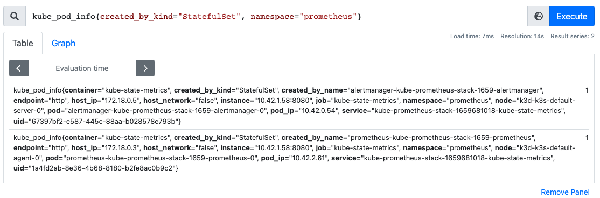
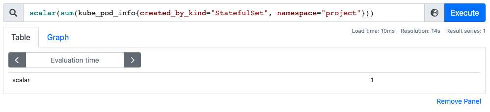
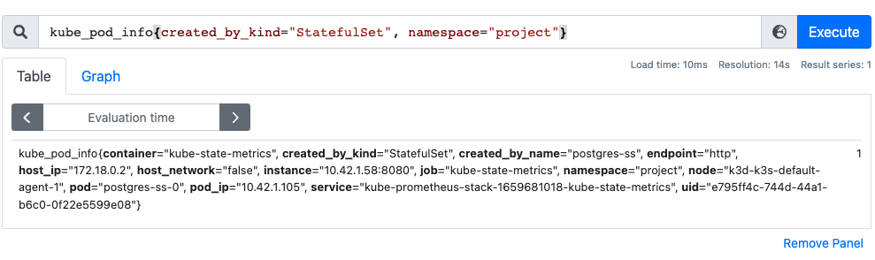
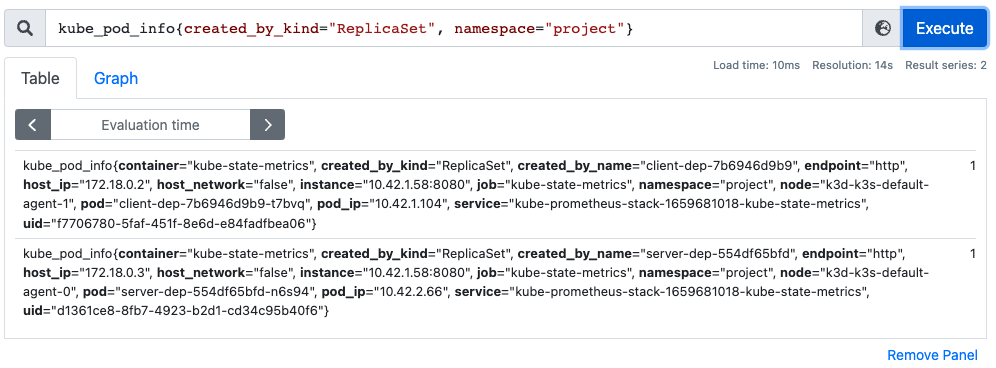

# Exercise 4.03: Prometheus

Case on which we only get the number of Statefulset

Case on which we query the information of those pods

___

I tested also with the deployment of the `project`
---

Case on which we only get the number of Statefulset

Case on which we query the information of those pods

And the last one checking the replicas of the project

