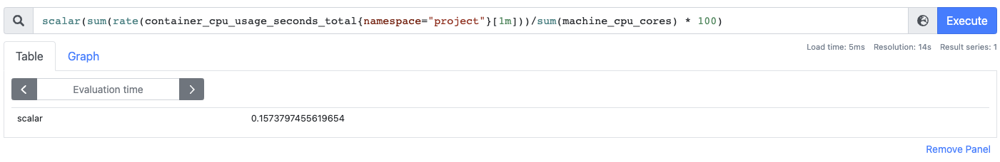

# Exercise 4.04: Project v1.8

After doing the following changes to the [analysistemplate.yaml](./manifests/analysistamplate.yaml) file
```yaml
apiVersion: argoproj.io/v1alpha1
kind: AnalysisTemplate
metadata:
  name: cpu-usage-rate
  namespace: project
spec:
  metrics:
  - name: cpu-usage-rate
    initialDelay: 4m
    successCondition: result < 2
    provider:
      prometheus:
        address: http://kube-prometheus-stack-1659-prometheus.prometheus:9090
        query: |
          scalar(
            sum(rate(container_cpu_usage_seconds_total{namespace="project"})) / sum(machine_cpu_core) * 100
            )
```

Result of the query on Prometheus



The image of the client can be found [here](https://hub.docker.com/r/sirpacoder/client)

The image of the server can be found [here](https://hub.docker.com/r/sirpacoder/server)

We can open the UI on the [http://localhost:8081](http://localhost:8081) port from the broswer

And we can access the backend from [http://localhost:8081/api/todos](http://localhost:8081/api/todos) port in the broswer