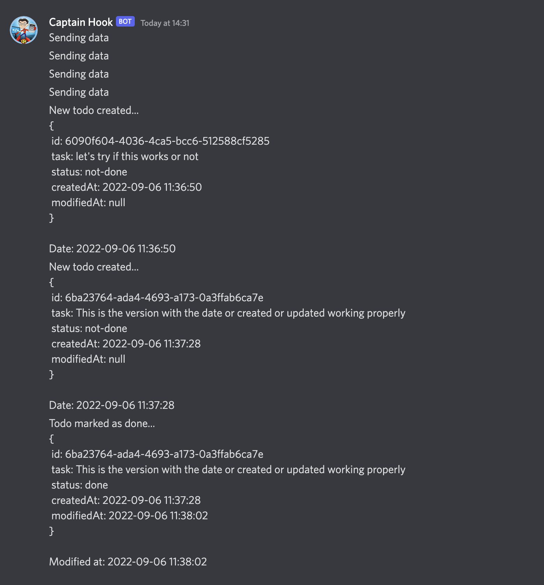

# Exercise 4.06: Project v2.0

[broadcaster.yaml](./manifests/broadcaster.yaml) file
```yaml
# Deployment
apiVersion: apps/v1
kind: Deployment
metadata:
  name: broadcaster-dep
  namespace: project
spec:
  replicas: 6
  selector:
    matchLabels:
      app: broadcaster
  template:
    metadata:
      labels:
        app: broadcaster
    spec:
      containers:
        - name: broadcaster
          image: sirpacoder/broadcaster:v4.06
          imagePullPolicy: Always
          env:
            - name: NATS_URL
              value: nats://my-nats:4222
          resources:
            requests:
              memory: '64Mi'
              cpu: '250m'
            limits:
              memory: '516Mi'
              cpu: '500m'
```

Result from the discord bot



___


The image of the client can be found [here](https://hub.docker.com/r/sirpacoder/client)

The image of the server can be found [here](https://hub.docker.com/r/sirpacoder/server)

The image of the server can be found [here](https://hub.docker.com/r/sirpacoder/broadcaster)

We can open the UI on the [http://localhost:8081](http://localhost:8081) port from the broswer

Health check is done by checking [http://localhost:8081/healthz](http://localhost:8081/healthz) endpoint from the broswer

And we can access the backend from [http://localhost:8081/api/todos](http://localhost:8081/api/todos) enpoint in the broswer