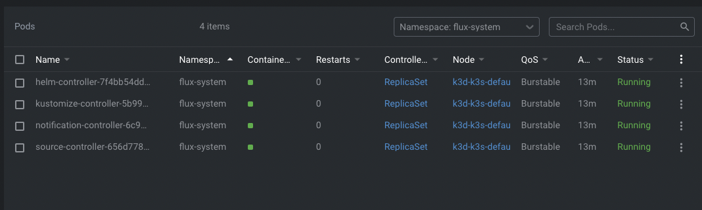

# Exercise 4.07: GitOpsify Cluster

For this exercise I simply followed what was instructed on the [course material](https://devopswithkubernetes.com/part-4/3-gitops).

I deleted the cluster using

```
$ k3d cluster delete
```

then created it again using 

```
$ k3d cluster create --port 8082:30080@agent:0 -p 8081:80@loadbalancer --agents 2
```

followed by the flux bootstraping using the commands below

```
$ export GITHUB_TOKEN=<MY_GITHUB_TOKEN>

$ flux bootstrap github \
    --owner=PacoZG \
    --repository=kube-cluster-dwk \
    --personal \
    --private=false
````

Then deployment was succesful without using `$ kubectl apply ...` comand



