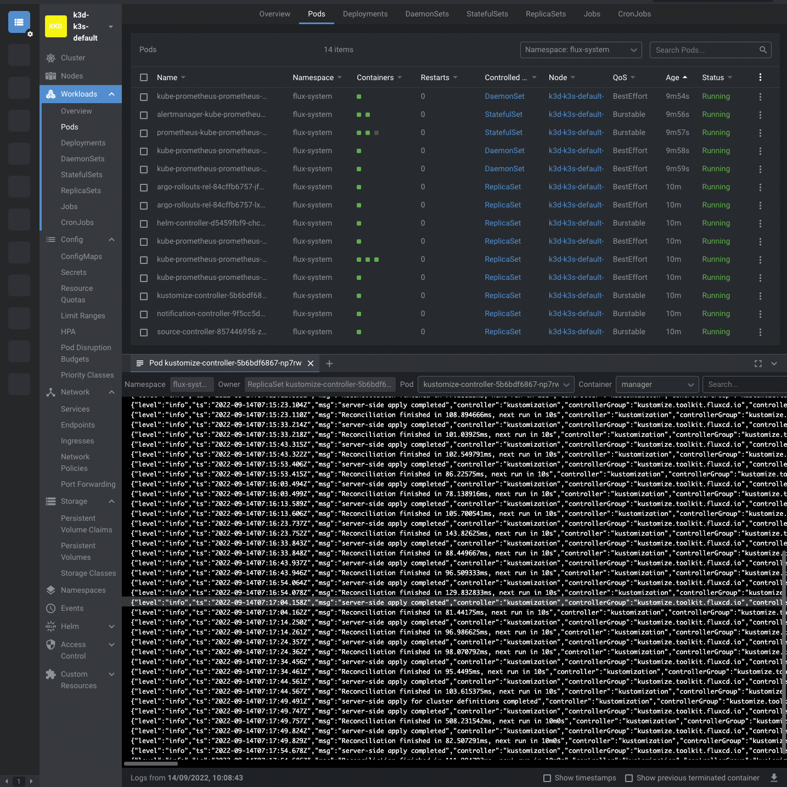
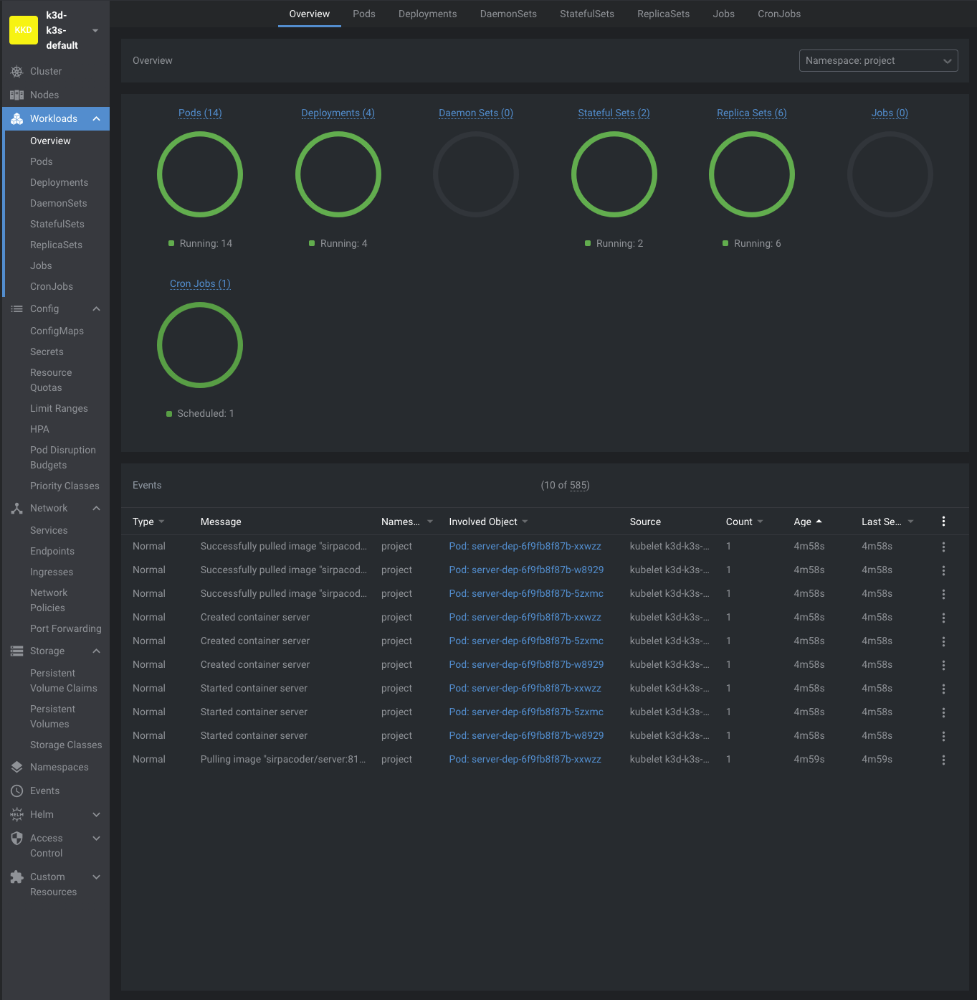

# Exercise 4.08: Project v2.1

For this exercise I following what was instructed on the [course material](https://devopswithkubernetes.com/part-4/3-gitops) and doing a lot of try and error

After creating the [kube-project-cluster-dwk](https://github.com/PacoZG/kube-project-cluster-dwk) to automatically update the deployments, then configuring the [pipeline](https://github.com/PacoZG/dwk-project/blob/main/.github/workflows/project-gitops.yaml) in the project with its respective configurations coming from the kustomization.yaml files found in the [manifests](https://github.com/PacoZG/dwk-project/tree/main/manifests) directory, the [client](https://github.com/PacoZG/dwk-project/tree/main/manifests/client) and [server](https://github.com/PacoZG/dwk-project/tree/main/manifests/server) directories and also doing plenty of try and errors I manage to set the project in a way that it will in fact create new images of the updated code and their also new tag and push them to the docker hub that will consequently be used to deploy the environment locally on k8s.

The following are some scrennshots that show some of the logs of the 
kustomize-controller-5b6bdf6867-np7rw pods and all the pods currently running on the projects namespace

